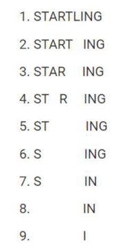
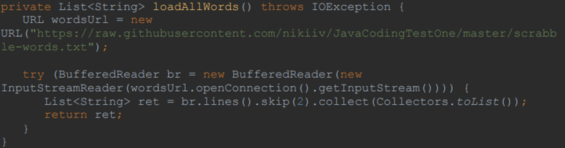

# findValidNineLetterWords #

I. Find all 9-letter words in the English language for which, for each word in the solution, the following is true:
- it is possible to remove one letter from the word and get a valid 8-letter word;
- one letter can be removed from the 8-letter word and a valid 7-letter word can be obtained;
- from the 7-letter word one letter can be removed and a valid 6-letter word is obtained, etc., until a one-letter valid word is obtained;
- valid single letter words are "I" and "A"
  You can see an example of the word "STARTLING" from here: 
https://www.republicworld.com/whatsapp-quizzes-and-puzzles/riddles/what-9-letter-word-is-still-a-word-after-removing-one-letter-each-time.html

Summary: to find all valid 9-letter words that can be reduced to one-letter words by removing one letter in stages, with each removal resulting in a new valid word.

II. The task must be optimized for speed. If a word is valid under one combination of letter removals, there is no need to check whether it would be valid if we removed other letters.
A list of all words in the English language can be accessed from here: 
https://raw.githubusercontent.com/nikiiv/JavaCodingTestOne/master/scrabble-words.txt

III. Preferably the solution should NOT read a local file but load as a URL, like this:

